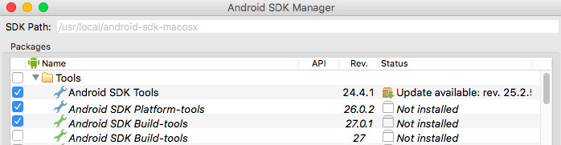
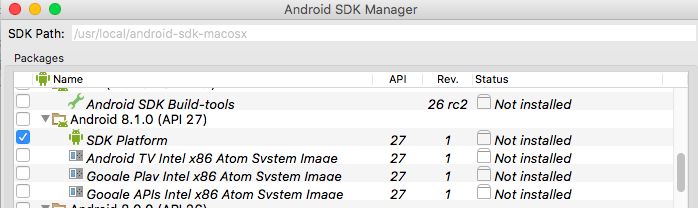
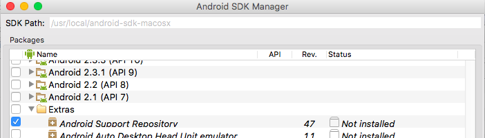
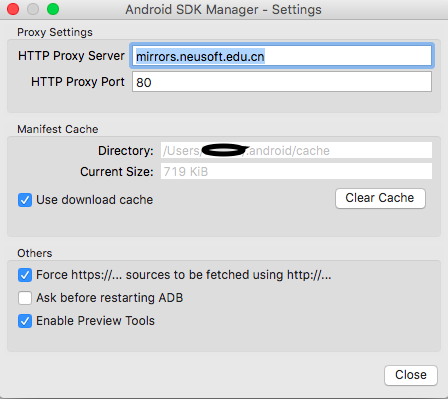
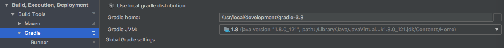

# MacOS Android开发环境配置
## 安装并配置Java Home。
Java的环境配置比较简单，直接安装或者解压，配置对应的Java Home即可。这里着重描述下Android SDK安装配置及Gradle配置。
## Android SDK for Mac 配置
### 下载解压到/usr/local/android-sdk-macosx目录下
[下载地址1](http://down.tech.sina.com.cn/page/45703.html)
[下载地址2](http://mac.softpedia.com/get/Developer-Tools/Google-Android-SDK.shtml)
### 安装
不需要全部安装，我们只需要有选择安装需要的部分即可。在官方指导中，
[官方原话看这里](https://link.jianshu.com/?t=http://developer.android.com/sdk/installing/adding-packages.html)
在SDK Manager中需要安装以下内容：
-  Tools
    - Android SDK Tools
    - Android SDK Platform-tools
    - Android SDK Build-tools (最高版本)
- Android X.X 文件夹选择:
    - SDK Platform（至少下载 compile sdkVersion 对应的版本）
    - ARM EABI v7a System Image（非必须，模拟器需要）
    - Sources for Android SDK（非必须，一个好的程序员得多看看源码😁）
- Extras目录下：
    - Android Support Repository
```
#那么执行安装咯
cd /usr/local/android-sdk-macosx/tools/
./android sdk
```
然后就是选择自己要安装的一路下一步咯




## 如果下载慢的无法忍受，国内有这些服务器可以用，需要先设置代理


Android SDK在线更新镜像服务器
- 1.中国科学院开源协会镜像站地址:

    - IPV4/IPV6: mirrors.opencas.cn 端口：80

    - IPV4/IPV6: mirrors.opencas.org 端口：80

    - IPV4/IPV6: mirrors.opencas.ac.cn 端口：80

- 2.上海GDG镜像服务器地址:

    - sdk.gdgshanghai.com 端口：8000

- 3.北京化工大学镜像服务器地址:

    - IPv4: ubuntu.buct.edu.cn/ 端口：80

    - IPv4: ubuntu.buct.cn/ 端口：80

    - IPv6: ubuntu.buct6.edu.cn/ 端口：80

- 4.大连东软信息学院镜像服务器地址:

    - mirrors.neusoft.edu.cn 端口：80

- 5.腾讯Bugly 镜像:

    - android-mirror.bugly.qq.com 端口：8080

腾讯镜像使用方法:
http://android-mirror.bugly.qq.com:8080/include/usage.html

这个代理列表来源于网上，不一定都还好用，在我下载的时候，东软的服务器还是正常的，不妨一试。

## 一切安装就绪后，我们还需要手工配置下Gradle
如果不手工配置Gradle，很大概率会在新建项目的时候报如下错误：
```
Error:Failed to open zip file.
Gradle's dependency cache may be corrupt (this sometimes occurs after a network connection timeout.)
```
那么我们来手工配置下Gradle。

- 手工下载Gradle 3.3压缩包 [Gradle 3.3下载](https://services.gradle.org/distributions/gradle-3.3-bin.zip)
- 解压下载的文件，并放置在/usr/local/development/gradle-3.3 目录下。
- 打开Android Studio/IDEA 到 
IntelliJ IDEA->Preferences...->Build,Exectution,Deployment->Gradle
配置Gradle Home

- 同步即可。
