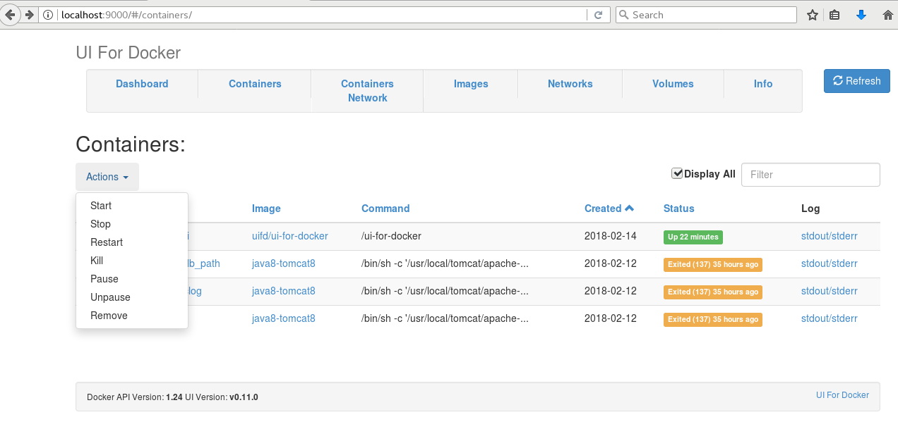

# docker入门(六)本地web管理工具-DockerUI

Docker提供一个平台来把应用程序当作容器来打包、分发、共享和运行，它已经通过节省工作时间来拯救了成千上万的系统管理员和开发人员。Docker不用关注主机上运行的操作系统是什么，它没有开发语言、框架或打包系统的限制，并且可以在任何时间、任何地点运行，从小型计算机到高端服务器都可以。
由于运行Docker容器和管理它们可能会花费一点点努力和时间，因为基于web的应用程序－DockerUI应运而生，它可以让管理和运行容器变得很简单。DockerUI是一个开源的基于Docker API的web应用程序，提供等同Docker命令行的大部分功能，支持container管理，image管理。它最值得称道的是它华丽的设计和用来运行和管理docker的简洁的操作界面。

- DockerUI优点：
- - 1）支持container批量操作；
- - 2）支持image管理（虽然比较薄弱）
 
- DockerUI缺点：
- - 不支持多主机。

下面，我们来挽起袖子，切身体会的部署一把：

```bash
#No1.查询，拉取镜像文件。
[root@localhost Downloads]# docker search docker-ui
INDEX       NAME                                     DESCRIPTION                                     STARS     OFFICIAL   AUTOMATED
docker.io   docker.io/jenkins                        Official Jenkins Docker image                   3396      [OK]       
docker.io   docker.io/alpine                         A minimal Docker image based on Alpine Lin...   3152      [OK]       
docker.io   docker.io/registry                       The Docker Registry 2.0 implementation for...   1862      [OK]       
docker.io   docker.io/swarm                          Swarm: a Docker-native clustering system.       820       [OK]       
docker.io   docker.io/docker                         Docker in Docker!                               670       [OK]       
docker.io   docker.io/fedora                         Official Docker builds of Fedora                628       [OK]       
docker.io   docker.io/hello-world                    Hello World! (an example of minimal Docker...   442       [OK]       
docker.io   docker.io/atcol/docker-registry-ui       A web UI for easy private/local Docker Reg...   97                   [OK]
docker.io   docker.io/uifd/ui-for-docker             A web interface for Docker, formerly known...   82                   [OK]
docker.io   docker.io/docker-dev                     Docker is an open source project to pack, ...   71        [OK]       
docker.io   docker.io/swaggerapi/swagger-ui          A simple docker container for hosting swag...   64                   
docker.io   docker.io/francescou/docker-compose-ui   web interface for Docker Compose                57                   [OK]
docker.io   docker.io/schickling/swagger-ui          Swagger UI 2.2.8 with API_URL, API_KEY and...   48                   [OK]
docker.io   docker.io/jippi/hashi-ui                 A user interface for the HashiCorp Nomad s...   15                   
docker.io   docker.io/joxit/docker-registry-ui       Docker registry v2 web User Interface           6                    [OK]
docker.io   docker.io/purpleworks/fleet-ui           Web based UI for fleet                          6                    
docker.io   docker.io/dtagdevsec/ui-for-docker       ui-for-docker                                   5                    [OK]
docker.io   docker.io/mlabouardy/dockerswarm-ui      DockerSwarm UI is 100% compatible with the...   3                    
docker.io   docker.io/hsldevcom/digitransit-ui       Digitransit-ui is a mobile friendly user i...   1                    
docker.io   docker.io/steinf/ui                      Musitude Ui                                     1                    
docker.io   docker.io/broadinstitute/firecloud-ui    firecloud-ui docker container                   0                    
docker.io   docker.io/cvandal/nomad-ui               A UI for Nomad by HashiCorp                     0                    
docker.io   docker.io/igeolise/docker-uikit          uikit                                           0                    [OK]
docker.io   docker.io/kidibox/kidibox-ui             kidibox-ui                                      0                    [OK]
docker.io   docker.io/splatform/stratos-ui           Complete build of Stratos UI (Cloudfoundry)     0                    
#找到我们要用的镜像文件，拉取
[root@localhost Downloads]# docker pull uifd/ui-for-docker
Using default tag: latest
Trying to pull repository docker.io/uifd/ui-for-docker ... 
latest: Pulling from docker.io/uifd/ui-for-docker
841194d080c8: Pull complete 
Digest: sha256:fe371ff5a69549269b24073a5ab1244dd4c0b834cbadf244870572150b1cb749

#查看拉取结果，出人意料的小阿
[root@localhost Downloads]# docker images
REPOSITORY                     TAG                 IMAGE ID            CREATED             SIZE
docker.io/uifd/ui-for-docker   latest              965940f98fa5        17 months ago       8.096 MB

#接着，我们要让它运行起来，以供我们使用
[root@localhost Downloads]# docker run -d --name docker-ui -p 9000:9000 --privileged -v /var/run/docker.sock:/var/run/docker.sock uifd/ui-for-docker
5a5cafe666e65e794b941f4f31b5ce5b80ba83eb85769a3e4f6f2c817be20d4d
```
Ok，看到输出的一串字符后，表示启动成功，在浏览器中输入
http://localhost:9000
简洁的界面出现在我们眼前啦。我们可以通过Containers/Images等几个模块，完成从pull images，创建container，启动container，关闭/重启/强制退出container，以前我们要靠命令来解决的现在都可以通过界面来操作了。

打开是这个样子的

容器管理是这个样子的，可以点开某个容器，进行管理，也可以选中某个容器，直接左上的actions操作。

看，actions这样用的

或者进入明细阿

镜像是这样的，一样可以点击明细进入管理。

更多内容可移步至官方项目

[kevana/ui-for-docker](https://github.com/kevana/ui-for-docker)
