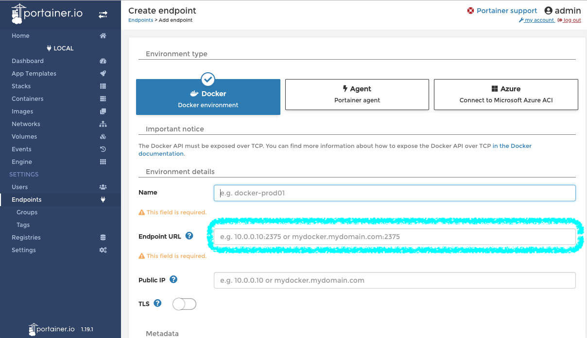
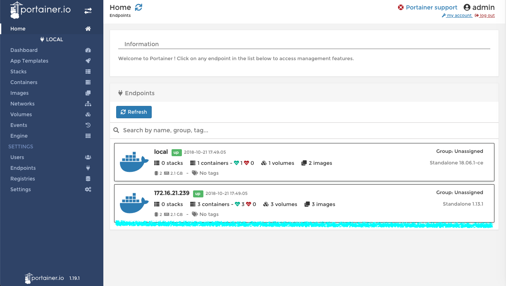
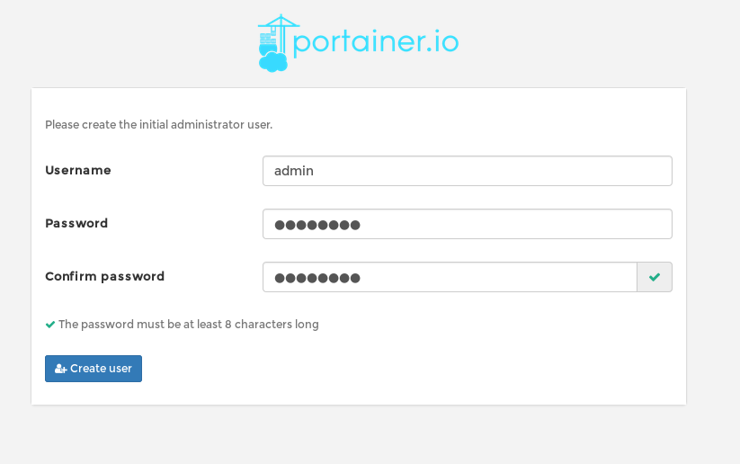
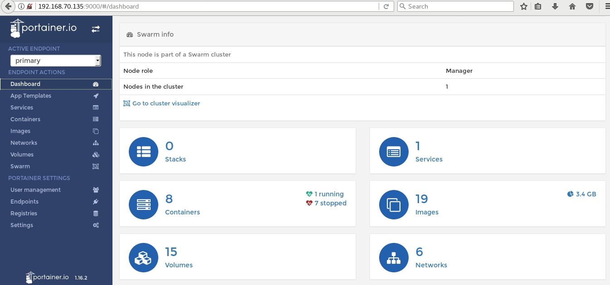
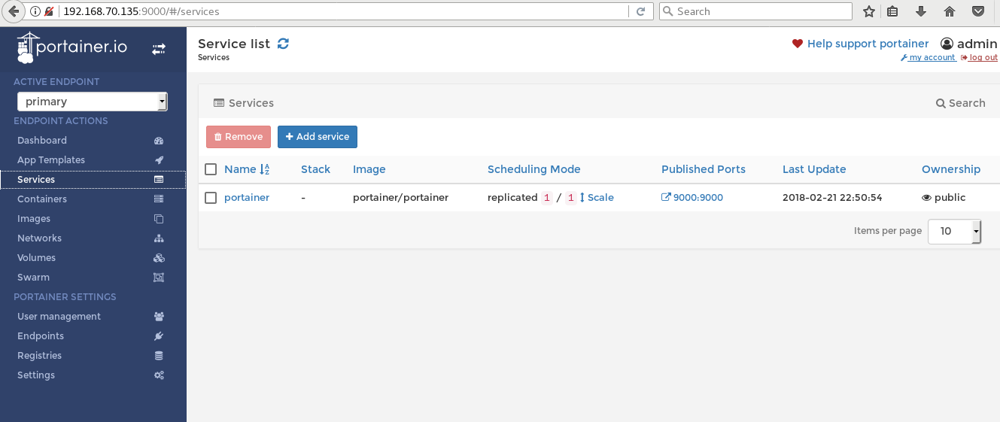
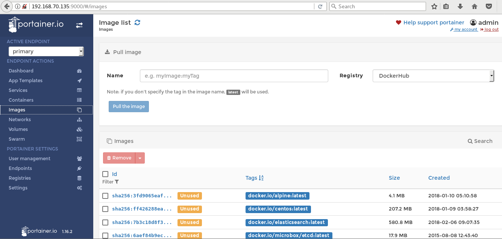
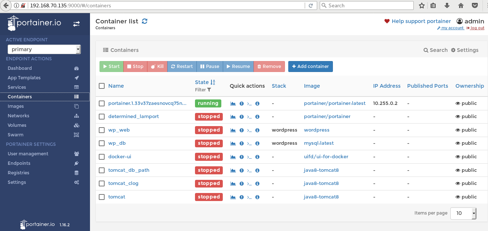
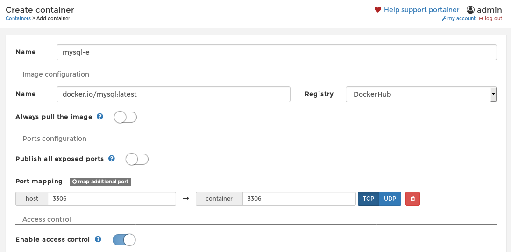
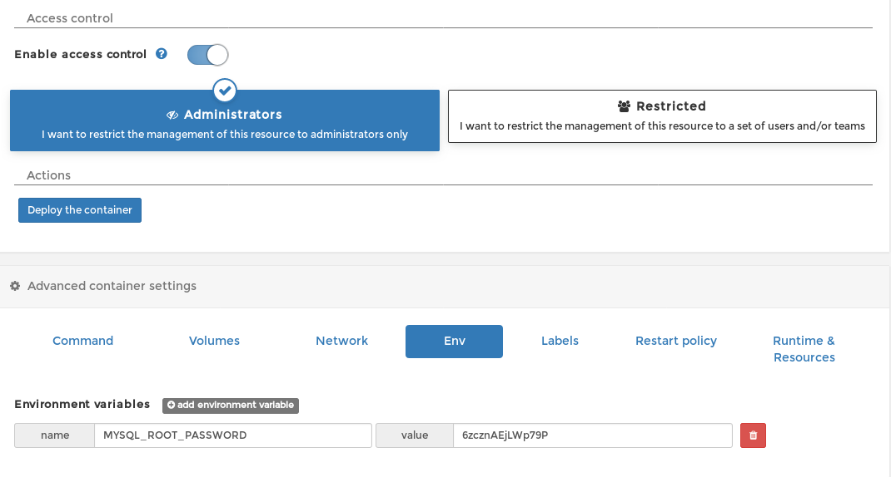

# docker入门(十)docker集中化web界面管理平台-Portainer

shipyard的gitbug上贴着一张大大的png图，作者说，维护的活太苦逼了，希望找人分担阿，找人分担了阿。。。
看了心里一凉，怪不得shipyard部署这么多问题，终于找到了症结了，那么更希望找到一个同类的管理平台，然后就有了portainer，不对，然后就有了这篇介绍portainer的文章。
portainer是多面手，可以做单机管理，也可以做集群管理，做单机管理的时候，和DockerUI一样便捷甚至更好用，做集群管理的时候也没有shipyard部署那般繁琐。
portainer管理集群的话，和shipyard有点类似，都是靠Swarm来称霸江湖的，那我们先来看看单机的效果：

### 配置Portainer单机管理

```bash
#拉取镜像文件
[root@localhost ~]# docker pull portainer/portainer

#run
[root@localhost ~]# docker run -d -p 9001:9000 --name portainer --restart=always --privileged=true -v /var/run/docker.sock:/var/run/docker.sock portainer/portainer
8f37d60a1a5f4879183c5985a8109748c5dc99d7110b1f3ec14b4d2050930977

#查看容器状态
[root@localhost ~]# docker ps
CONTAINER ID        IMAGE                 COMMAND                  CREATED             STATUS              PORTS                    NAMES
8f37d60a1a5f        portainer/portainer   "/portainer"             26 seconds ago      Up 25 seconds       0.0.0.0:9001->9000/tcp   determined_lamport
```

然后，输入http://locahost:9001看看，上来先要输入admin的密码，重复输入后确认，选择本地还是远程管理，当然选择本地了，稍后我们配置Swarm讲下怎么管理远程docker。

### 配置管理远程节点

 - 1 查看远程节点docker启动文件

```bash
# systemctl status docker

● docker.service - Docker Application Container Engine
   Loaded: loaded (/usr/lib/systemd/system/docker.service; enabled; vendor preset: disabled)
   Active: active (running) since Sun 2018-10-21 17:34:33 CST; 27min ago
     Docs: http://docs.docker.com
 Main PID: 6809 (dockerd-current)
    Tasks: 62
   Memory: 34.7M
   CGroup: /system.slice/docker.service
           ├─6809 /usr/bin/dockerd-current -H tcp://0.0.0.0:2375 -H unix:///v...
           ├─6816 /usr/bin/docker-containerd-current -l unix:///var/run/docke...
           ├─6917 /usr/libexec/docker/docker-proxy-current -proto tcp -host-i...
           ├─6923 /usr/bin/docker-containerd-shim-current 11ff6b5f3706e35c769...
           ├─6950 /usr/libexec/docker/docker-proxy-current -proto tcp -host-i...
           ├─6960 /usr/bin/docker-containerd-shim-current d8dc53635933373521e...
           ├─7029 /usr/libexec/docker/docker-proxy-current -proto tcp -host-i...
           └─7034 /usr/bin/docker-containerd-shim-current 84719bedeeb9ca4514a...
```

找到启动文件位置为/usr/lib/systemd/system/docker.service

```bash
# sudo vim /usr/lib/systemd/system/docker.service
```

- 2 修改启动文件为:

```conf
ExecStart=/usr/bin/dockerd-current -H tcp://0.0.0.0:2375 -H unix:///var/run/docker.sock\
```

- 3 Portainer 中添加远程节点name/ip:port, 如下图:



添加成功后,点击左侧home菜单能看到远程节点,点击节点即可进入管理.


如果添加失败,请查看远程节点机器的防火墙是否加入了2376/tcp端口.

### 配合Swarm配置集群管理

- 配置环境准备工作

- - 禁用selinux
编辑服务器的/etc/selinux/config文件,在 SELINUX=enforcing 前面加个#号注释掉，然后新加一行
SELINUX=disabled
最终/etc/selinux/config文件是这样的：
```conf
# This file controls the state of SELinux on the system.
# SELINUX= can take one of these three values:
#     enforcing - SELinux security policy is enforced.
#     permissive - SELinux prints warnings instead of enforcing.
#     disabled - No SELinux policy is loaded.
#SELINUX=enforcing
SELINUX=disabled
# SELINUXTYPE= can take one of three two values:
#     targeted - Targeted processes are protected,
#     minimum - Modification of targeted policy. Only selected processes are protected. 
#     mls - Multi Level Security protection.
SELINUXTYPE=targeted
```
- - 开启每台服务器上防火墙端口
```bash
#centos 7
[root@localhost ~]# firewall-cmd --permanent --add-port=2376/tcp
[root@localhost ~]# firewall-cmd --permanent --add-port=2377/tcp
[root@localhost ~]# firewall-cmd --permanent --add-port=7946/tcp
[root@localhost ~]# firewall-cmd --permanent --add-port=7946/udp
[root@localhost ~]# firewall-cmd --permanent --add-port=4789/udp
[root@localhost ~]# firewall-cmd --permanent --add-port=80/tcp
[root@localhost ~]# firewall-cmd --reload

#centos 6
[root@localhost ~]# /sbin/iptables -I INPUT -p tcp --dport 2376 -j ACCEPT
[root@localhost ~]# /sbin/iptables -I INPUT -p tcp --dport 2377 -j ACCEPT
[root@localhost ~]# /sbin/iptables -I INPUT -p tcp --dport 7946 -j ACCEPT
[root@localhost ~]# /sbin/iptables -I INPUT -p udp --dport 7946 -j ACCEPT
[root@localhost ~]# /sbin/iptables -I INPUT -p tcp --dport 4789 -j ACCEPT
[root@localhost ~]# /sbin/iptables -I INPUT -p tcp --dport 80 -j ACCEPT
[root@localhost ~]# /etc/rc.d/init.d/iptables save
[root@localhost ~]# /etc/init.d/iptables restart

#重启docker
[root@localhost ~]# systemctl restart docker
```

- - 编辑服务器的/etc/hosts文件
```c
192.168.170.135    manager.eureka.org   manager
...                node1.eureka.org     node1
...                node2.eureka.org     node2
```
测试中我没有配置node1，node2，因为此处ip地址省略，在每台服务器上配置各自的即可。所以，在我测试的服务器上，我配置了
```c
192.168.170.135    manager.eureka.org   manager
```
- 安装Swarm
```bash
#初始化Swarm服务端
[root@localhost ~]# docker swarm init --advertise-addr 192.168.70.135
Swarm initialized: current node (c8wbhaj8gw897djwckry7q70f) is now a manager.

To add a worker to this swarm, run the following command:

    docker swarm join \
    --token SWMTKN-1-22qqbqov00v6581g18h24br4w51sdbfk6oxqnafwz6aqqastss-e019ry25bwvssp5wx12k5xg5l \
    192.168.70.135:2377

To add a manager to this swarm, run 'docker swarm join-token manager' and follow the instructions.

#根据服务端返回的内容，我们可以初始化各个子节点了，在其他的节点上执行：
docker swarm join \
    --token SWMTKN-1-22qqbqov00v6581g18h24br4w51sdbfk6oxqnafwz6aqqastss-e019ry25bwvssp5wx12k5xg5l \
    192.168.70.135:2377
This node joined a swarm as a worker.

#在服务端查看节点，因为我还没有加入子节点，所以显示只有服务端
[root@localhost ~]# docker node ls
ID                           HOSTNAME               STATUS  AVAILABILITY  MANAGER STATUS
c8wbhaj8gw897djwckry7q70f *  localhost.localdomain  Ready   Active        Leader
```
- 安装Portainer
```bash
docker service create \
--name portainer-net \
--restart=always \
--publish 9000:9000 \
--constraint 'node.role == manager' \
--mount type=bind,src=/var/run/docker.sock,dst=/var/run/docker.sock \
portainer/portainer \
-H unix:///var/run/docker.sock
```
输入http://192.168.70.135:9000，设置用户名密码：admin/admin123，然后就可以登陆查看管理了。









***多次测试后，发现这种通过服务创建Portainer容器的方式会有莫名的问题，每次服务器重启都需要重新初始化密码，后来发现竟然每次启动都会失败，然后docker会重新生成一个新的容器，鉴于这个问题，按照上面创建单机Portainer的方式创建容器，反倒解决了问题，并且在配置好Swarm的前提下，就可以管理集群上的资源，也可能是我什么地方操作有问题，记录下来供后来者参考指正。***

这个有官方的deploy说明：

[Portainer Deployment](https://portainer.readthedocs.io/en/latest/deployment.html)

