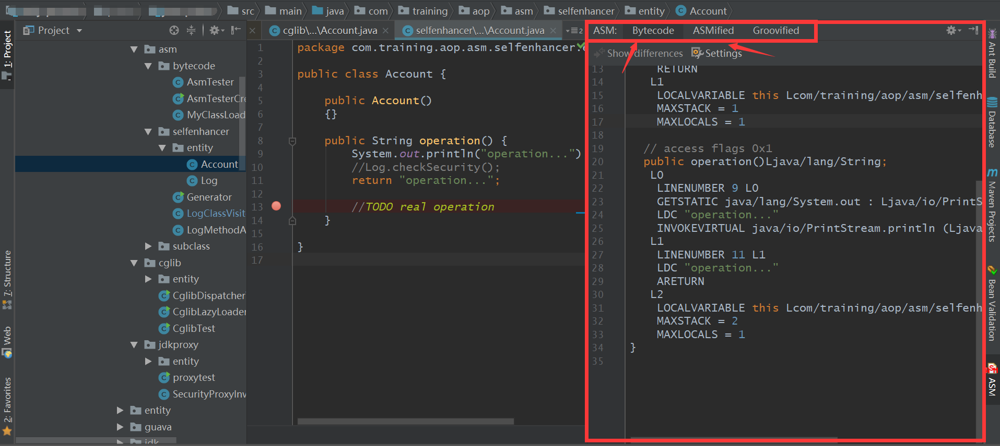

# Java字节码框架ASM-神兵利器篇

## 源码级
在我们激情coding的时候，我们可能需要知道某些代码怎么用ASM实现，这样就就能节省我们很多扣细节的时间，首先祭出必杀级工具：

- **IDEA之ASM Bytecode Outline**
- **Eclipse之ASM-Bytecode**
  
这两个神器有异曲同工之妙，我们用 **ASM Bytecode Outline**来看下效果。
- 安装插件
  **File -> Settings -> Plugins -> ASM Bytecode Outline -> Search in repositories**
  选中插件，在右侧点击Install即可。安装后在右侧可以看到ASM的选项卡。然后我们可施法了。
- 在IDEA中打开你的项目，选择要查看的java文件，右键选择 **show bytecode outline**
  短暂的等待后，我们可以看到右侧窗口中，不但显示了java文件的Bytecode，还是有ASMified，是不是对我们写ASM代码帮助很大？



## 字节码级

- **javap**
  
这是一个JDK自带的工具，使用也非常的简单，直接在终端运行命令即可，我们用一个测试类尝试下：

```java

public class AsmTester {

        public void run()
        {
            System.out.println("This is my first ASM test");
        }
}
```

接着，我们编译这个类得到一个class文件。编译过程省略，我们接着要把class类转换成字节码代码：
在class类所在的目录运行如下javap指令：

```java
javap -c -verbose AsmTester.class
```

得到如下结果：

```java
  Last modified 2018-8-3; size 549 bytes
  MD5 checksum 1d2f4392c734466dbc30d1ddf25f2036
  Compiled from "AsmTester.java"
public class com.training.aop.asm.bytecode.AsmTester
  minor version: 0
  major version: 52
  flags: ACC_PUBLIC, ACC_SUPER
Constant pool:
   #1 = Methodref          #6.#17         // java/lang/Object."<init>":()V
   #2 = Fieldref           #18.#19        // java/lang/System.out:Ljava/io/PrintStream;
   #3 = String             #20            // This is my first ASM test
   #4 = Methodref          #21.#22        // java/io/PrintStream.println:(Ljava/lang/String;)V
   #5 = Class              #23            // com/training/aop/asm/bytecode/AsmTester
   #6 = Class              #24            // java/lang/Object
   #7 = Utf8               <init>
   #8 = Utf8               ()V
   #9 = Utf8               Code
  #10 = Utf8               LineNumberTable
  #11 = Utf8               LocalVariableTable
  #12 = Utf8               this
  #13 = Utf8               Lcom/training/aop/asm/bytecode/AsmTester;
  #14 = Utf8               run
  #15 = Utf8               SourceFile
  #16 = Utf8               AsmTester.java
  #17 = NameAndType        #7:#8          // "<init>":()V
  #18 = Class              #25            // java/lang/System
  #19 = NameAndType        #26:#27        // out:Ljava/io/PrintStream;
  #20 = Utf8               This is my first ASM test
  #21 = Class              #28            // java/io/PrintStream
  #22 = NameAndType        #29:#30        // println:(Ljava/lang/String;)V
  #23 = Utf8               com/training/aop/asm/bytecode/AsmTester
  #24 = Utf8               java/lang/Object
  #25 = Utf8               java/lang/System
  #26 = Utf8               out
  #27 = Utf8               Ljava/io/PrintStream;
  #28 = Utf8               java/io/PrintStream
  #29 = Utf8               println
  #30 = Utf8               (Ljava/lang/String;)V
{
  public com.training.aop.asm.bytecode.AsmTester();
    descriptor: ()V
    flags: ACC_PUBLIC
    Code:
      stack=1, locals=1, args_size=1
         0: aload_0
         1: invokespecial #1                  // Method java/lang/Object."<init>":()V
         4: return
      LineNumberTable:
        line 3: 0
      LocalVariableTable:
        Start  Length  Slot  Name   Signature
            0       5     0  this   Lcom/training/aop/asm/bytecode/AsmTester;

  public void run();
    descriptor: ()V
    flags: ACC_PUBLIC
    Code:
      stack=2, locals=1, args_size=1
         0: getstatic     #2                  // Field java/lang/System.out:Ljava/io/PrintStream;
         3: ldc           #3                  // String This is my first ASM testString This is my first ASM test
         5: invokevirtual #4                  // Method java/io/PrintStream.println:(Ljava/lang/String;)V
         8: return
      LineNumberTable:
        line 7: 0
        line 8: 8
      LocalVariableTable:
        Start  Length  Slot  Name   Signature
            0       9     0  this   Lcom/training/aop/asm/bytecode/AsmTester;
}
SourceFile: "AsmTester.java"
```

- **asmtools.jar**

javap更适合我们研究文件结构使用，而asmtools更适合我们做查看和修改使用，
其反编译出来的字节码比javap -c反编译出来的更具可读性。接着我们来做一个演示：
首先，我们创建一个最简单的Java类

```java
package com.training.aop.asm.t1;

public class AsmTester {

        public void run()
        {
            System.out.println("This is my first ASM test");
        }
}
```

接着，我们编译这个类得到一个class文件。编译过程省略，我们接着要把class类转换成字节码代码：
在class类所在的目录，放一个我们要用的转换成字节码工具的jar文件：asmtools.jar，该jar文件为OpenJDK自带的工具，可以自己编译，也可以直接到这里下载编译好的jar文件：

[asmtools.jar下载](https://github.com/EurekaShow/notebook/blob/master/Java/bytecode/asmtools.jar)

接着，我们打开终端工具，cd到我们class文件的目录下，前提条件是已经下载了asmtools.jar并且已经放置在该目录下(不放置class文件目录下也可以，需要配置文件所在位置到系统的环境变量)。

```java
java -cp asmtools.jar org.openjdk.asmtools.jdis.Main AsmTester.class > AsmTester.jasm
```

用vscode打开AsmTester.jasm文件：

```java
package  com/training/aop/asm/t1;

super public class AsmTester
	version 52:0
{


public Method "<init>":"()V"
	stack 1 locals 1
{
		aload_0;
		invokespecial	Method java/lang/Object."<init>":"()V";
		return;
	
}

public Method run:"()V"
	stack 2 locals 1
{
		getstatic	Field java/lang/System.out:"Ljava/io/PrintStream;";
		ldc	String "This is my first ASM test";
		invokevirtual	Method java/io/PrintStream.println:"(Ljava/lang/String;)V";
		return;
	
}

} // end Class AsmTester
```

对比后会发现这个可读性真的有了很大的提升。
然后我们就可以动手修改这个字节码文件了，修改后，还可以重新编译成class文件，强不强？

- 附录 **Javap语法**

```java
javap [ 命令选项 ] class. . .
　　javap 命令用于解析类文件。其输出取决于所用的选项。若没有使用选项，javap 将输出传递给它的类的 public 域及方法。javap 将其输出到标准输出设备上。
命令选项
　　-help 输出 javap 的帮助信息。
　　-l 输出行及局部变量表。
　　-b 确保与 JDK 1.1 javap 的向后兼容性。
　　-public 只显示 public 类及成员。
　　-protected 只显示 protected 和 public 类及成员。
　　-package 只显示包、protected 和 public 类及成员。这是缺省设置。
　　-private 显示所有类和成员。
　　-J[flag] 直接将 flag 传给运行时系统。
　　-s 输出内部类型签名。
　　-c 输出类中各方法的未解析的代码，即构成 Java 字节码的指令。
　　-verbose 输出堆栈大小、各方法的 locals 及 args 数,以及class文件的编译版本
　　-classpath[路径] 指定 javap 用来查找类的路径。如果设置了该选项，则它将覆盖缺省值或 CLASSPATH 环境变量。目录用冒号分隔。
 　 -bootclasspath[路径] 指定加载自举类所用的路径。缺省情况下，自举类是实现核心 Java 平台的类，位于 jrelib下面。
　　-extdirs[dirs] 覆盖搜索安装方式扩展的位置。扩展的缺省位置是 jrelibext。
```