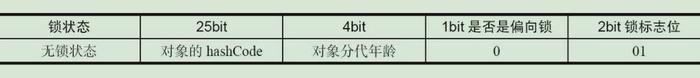
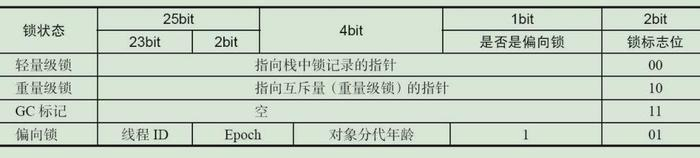

# Java并发编程-同步原理及锁优化

## Java对象头

HotSpot虚拟机中，对象在内存中存储分为三块区域：对象头、实例数据和对齐填充
HotSpot虚拟机的对象头(Object Header)包括两部分信息:
- **第一部分"Mark Word"**: 用于存储对象自身的运行时数据， 如哈希码（HashCode）、GC分代年龄、锁状态标志、线程持有的锁、偏向线程ID、偏向时间戳等等.

- **第二部分"Klass Pointer"**: 对象指向它的类的元数据的指针，虚拟机通过这个指针来确定这个对象是哪个类的实例。(数组，对象头中还须有一块用于记录数组长度的数据，因为虚拟机可以通过普通Java对象的元数据信息确定Java对象的大小，但是从数组的元数据中无法确定数组的大小。 )

对象头默认存储结构

在运行期间，Mark Word里存储的数据会随着锁标志位的变化而变化。Mark Word可能变化为存储以下4种数据（32位系统）

