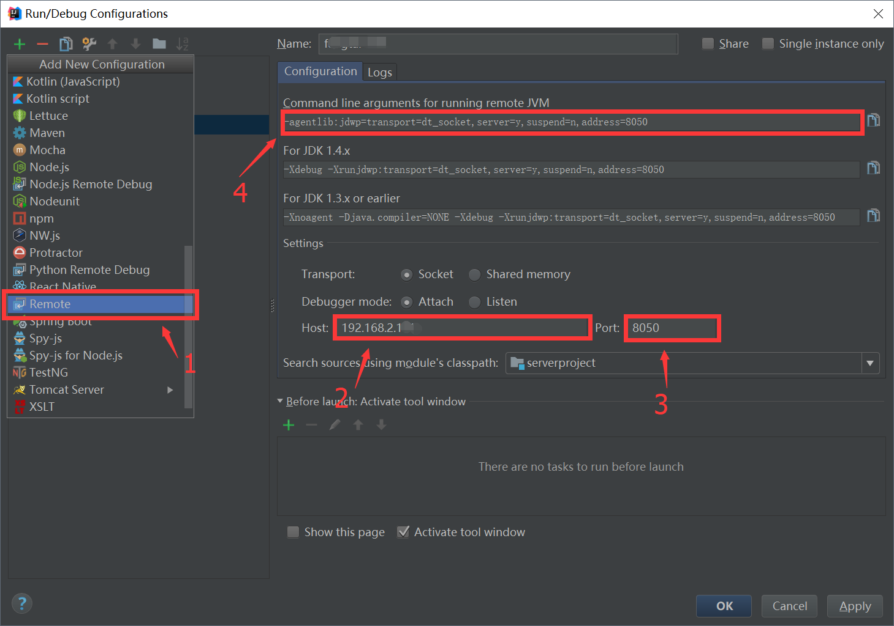
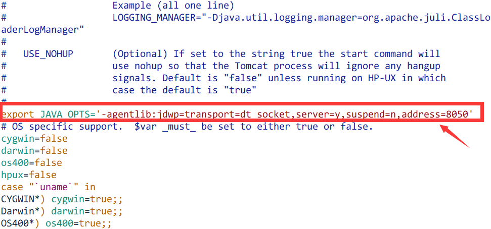
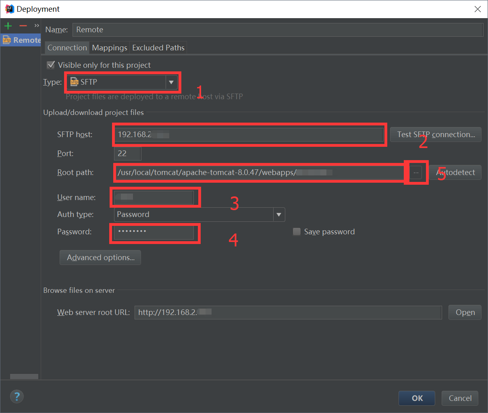
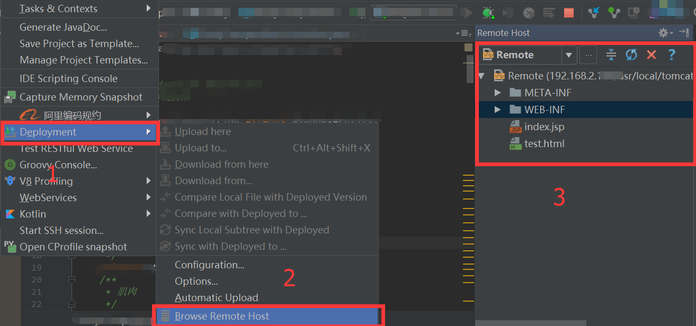

# IDEA远程调试Tomcat

## IDEA配置远程调试
配置如下图：


## Tomcat配置远程调试
### 复制JVM的相关参数，为更新tomcat配置做准备
```
-agentlib:jdwp=transport=dt_socket,server=y,suspend=n,address=8050
```
### 修改Tomcat配置
```
[root@localhost ~]# vim /usr/local/tomcat/apache-tomcat-8.0/bin/catalina.sh 
#在# OS specific support.上面添加
export JAVA_OPTS='-agentlib:jdwp=transport=dt_socket,server=y,suspend=n,address=8050'
```


## 配置防火墙
```
vim /etc/sysconfig/iptables 
#在-A INPUT -m state --state NEW -m tcp -p tcp --dport 22 -j ACCEPT之后添加
-A INPUT -m state --state NEW -m tcp -p tcp --dport 80 -j ACCEPT
-A INPUT -m state --state NEW -m tcp -p tcp --dport 8050 -j ACCEPT

#重启防火墙
service iptables restart

#如果嫌麻烦或者对安全要求不高直接关闭防火墙也行
service iptables stop
```
如果服务器上没有项目，发布编译后war到刚才的tomcat下，然后重启tomcat。
或者在IDEA中配置sftp上传。

## IDEA中配置sftp上传项目文件
### 菜单 Tools -> Deployment -> Configuration 配置远程服务器

### 菜单 Tools -> Deployment -> Browse Remote Host 打开配置的远程服务器选项卡


## 启动Remote Server调试
```
#控制台出现这个表示成功
Connected to the target VM, address: '192.168.2.106:8050', transport: 'socket'
```

## 下断点，浏览器打开项目即可跳转入设置的断点。